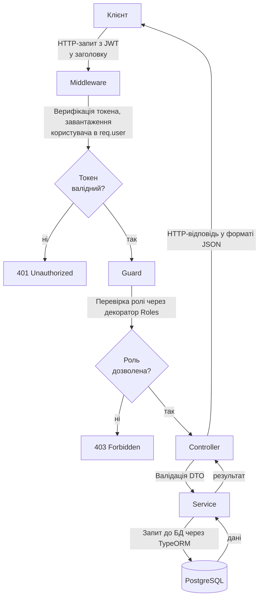

```mermaid
flowchart TB
    A[Клієнт] -->|HTTP-запит з JWT <br/> у заголовку| B[Middleware]
    B -->|Верифікація токена, завантаження<br/>користувача в req.user| C{Токен<br/>валідний?}
    C -->|ні| X1[401 Unauthorized]
    C -->|так| D[Guard]
    D -->|Перевірка ролі через декоратор Roles| E{Роль<br/>дозволена?}
    E -->|ні| X2[403 Forbidden]
    E -->|так| F[Controller]
    F -->|Валідація DTO| G[Service]
    G -->|Запит до БД через TypeORM| H[(PostgreSQL)]
    H -->|дані| G
    G -->|результат| F
    F -->|HTTP-відповідь у форматі JSON| A
```
