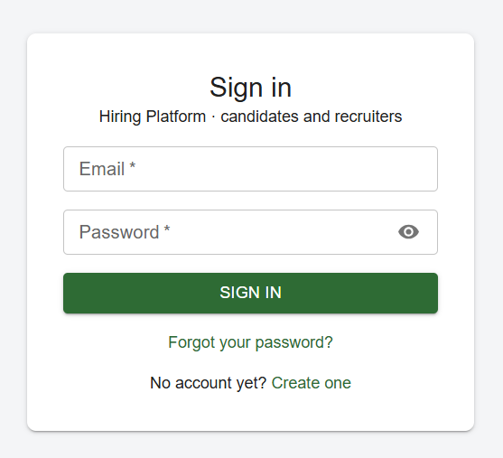
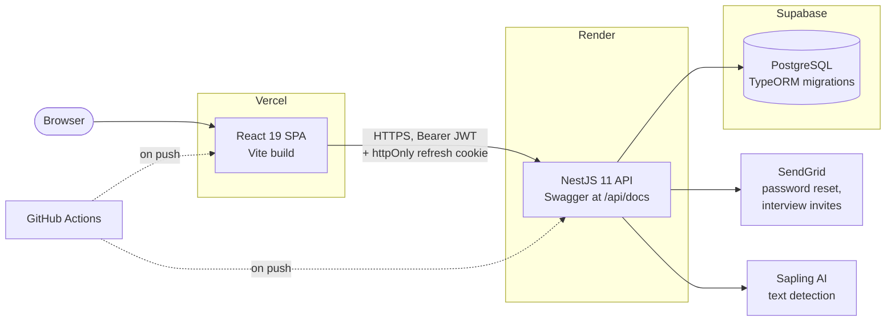
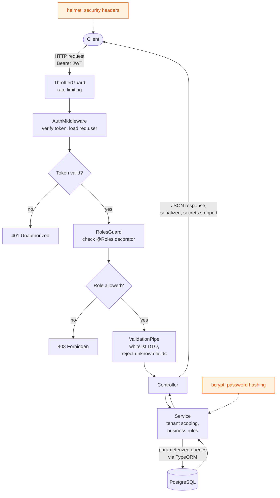
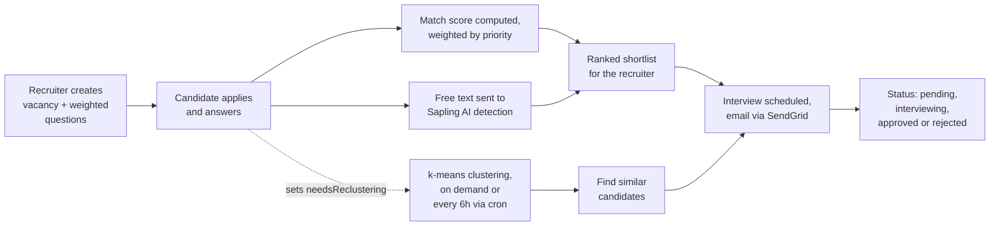

# Hiring Optimization & Automation Platform

[](https://github.com/kkatalz/hiring-optimization-and-automatization-platform/actions/workflows/backend-ci.yml)
[](https://github.com/kkatalz/hiring-optimization-and-automatization-platform/actions/workflows/frontend-ci.yml)

**A multi-tenant applicant tracking system that scores, ranks and clusters job applicants automatically.**

Recruiters publish vacancies with weighted requirements. Candidates apply answering required questions. The platform scores every submission against those requirements, gives extra points, groups similar
applicants together with k-means, and shows percentage of AI generated texts (resume, comment). A recruiter opens a
ranked list.

Full-stack TypeScript: NestJS API, React SPA, PostgreSQL. Deployed and running.

---

## Live demo

|                        |                                                         |
| ---------------------- | ------------------------------------------------------- |
| **Web app**            | https://hiring-optimization-and-automatizat.vercel.app/ |
| **API docs (Swagger)** | https://hiring-platform-api-h3bz.onrender.com/api/docs  |

> **Note.** The API runs on Render's free tier and sleeps after about 15 minutes of inactivity.
> The first request wakes it up and can take up to a minute. Give the first login a moment,
> everything after it is fast.

### Demo accounts

Every account uses the password `Password1!`.

| Role                | Email                 | What you can do                                                                                |
| ------------------- | --------------------- | ---------------------------------------------------------------------------------------------- |
| Candidate           | `alice@gmail.com`     | Browse vacancies, apply, track your submissions and interviews                                 |
| Recruiter           | `recruiter2@acme.com` | Create vacancies and questions, review ranked submissions, run clustering, schedule interviews |
| Admin (Acme Hiring) | `admin@acme.com`      | Everything a recruiter can do, plus manage users inside the company                            |
| Super admin         | `super@platform.com`  | Manage companies and users across the whole platform                                           |
| Admin (Bright HR)   | `admin@bright.com`    | A second, separate company                                                                     |

**Want to check the tenant isolation yourself?** Log in as `admin@acme.com` and note the vacancies,
questions and candidates you see. Then log in as `admin@bright.com`. You will not see a single one
of them. Every query is scoped to the caller's company, and a request for another company's resource
returns `403` rather than an empty list.

---

## Screenshots

<details>
<summary>Click to expand</summary>

**Sign in**



**Creating a vacancy**


**Filtering vacancies**


**Vacancy list**


</details>

---

## Roles and permissions

Authorization is role-based, enforced by a global guard reading a `@Roles()` decorator on each route,
and layered on top of company scoping.

| Role                | Scope         | Can do                                                                                                                                                  |
| ------------------- | ------------- | ------------------------------------------------------------------------------------------------------------------------------------------------------- |
| **Unauthenticated** | Public        | Browse and filter vacancies by tag, language and salary, see a vacancy's questions, sign up as a candidate, request a password reset                    |
| **Candidate**       | Own data      | Build a profile (experience, location, languages), apply to vacancies, answer vacancy questions, view own submissions and interviews                    |
| **Recruiter**       | One company   | Create and edit vacancies and question banks, view submissions ranked by match score, filter candidates, run clustering, schedule and cancel interviews |
| **Admin**           | One company   | Everything a recruiter can do, plus create and manage recruiters within the company                                                                     |
| **Super admin**     | Platform-wide | Create and manage companies, manage any user, read across all tenants                                                                                   |

A recruiter who requests a resource belonging to another company gets `403 Forbidden`, not a silently
filtered result. Object-level checks run in the service layer, not only at the route.

---

## How the matching works

This is the part of the project I spent the most time on.

### Match score

Every vacancy carries a set of questions, and each question has a **priority**. The weight of a
question is `1 / priority`, so a priority 1 question counts double a priority 2 question. When a
candidate submits answers, the service scores each answer against the expected value, sums the
weighted matches, and divides by the total weight:

```
matchScore = sum(weight * isMatch) / sum(weight)
```

The score is stored on the submission, so the recruiter's list is sorted by fit the moment it loads.
The API also returns a `MatchScoreExplanationDto` with a per-question breakdown, so the number can
always be traced back to the answers that produced it.

Language requirements are matched by rank rather than by string. A vacancy asking for English at B2
is satisfied by C1, C2 and NATIVE. A requirement may also omit either half: a code alone means
"this language, any level", a level alone means "any language, at least this level".

### Clustering similar applicants

Match score answers "how good is this candidate". Clustering answers "who else looks like them".

Each submission is turned into a numeric feature vector built from the vacancy's own shape:

```
[ question answers... , expected salary , tag overlap... , years of experience , language levels... ]
```

Every component is normalised to `0..1` so no single dimension dominates. Salary is scaled against
the range of the actual applicant pool, experience against the vacancy requirement, language levels
against the CEFR rank order.

The vectors go through k-means (`ml-kmeans`, fixed seed for reproducible results) with

```
k = max(2, ceil(sqrt(n / 2)))
```

so the number of groups grows with the applicant pool instead of being hard-coded. A recruiter can
then ask for candidates similar to any given one, and the API returns the rest of that cluster.

Clustering runs on demand via `POST /clustering/run/:vacancyId`, and also on a schedule. Any change
that invalidates a vacancy's grouping, such as a new submission or an edited requirement, sets a
`needsReclustering` flag, and a cron job picks those vacancies up every six hours. Recruiters never
wait on it, and the work only happens for vacancies that actually changed.

### AI-generated answer detection

Candidate comments to vacancies and resumes are sent to the Sapling AI-detection API, which returns a score plus per-sentence scores. Calls are time-boxed with an `AbortController` and
fail open: if the key is missing or the service is slow, the submission still goes through. The
platform flags suspicious text, it never blocks a candidate because a third-party API is down.

---

## Architecture

### Deployment topology



Sessions live in an httpOnly refresh-token cookie plus a short-lived access
token.

### Request lifecycle and security

Every request walks the same path.



What each layer contributes:

- **Throttler** caps request rates globally, with tighter per-route limits on login, refresh, logout and password reset (10 per minute).
- **Auth middleware** verifies the access token and attaches the user, so no controller has to parse a header.
- **Roles guard** reads the `@Roles()` decorator. No decorator means no access.
- **ValidationPipe** runs with `whitelist`, `forbidNonWhitelisted` and `forbidUnknownValues`, so an unexpected field is a `400`, not silent data.
- **ClassSerializerInterceptor** strips excluded fields, so a password hash cannot leak through a response by accident.
- **Refresh tokens rotate.** `POST /auth/refresh` validates the request origin, issues a new access token _and_ a new refresh token, and clears the cookie on any failure.

### The hiring pipeline



---

## Tech stack

**Backend**

|           |                                                                                      |
| --------- | ------------------------------------------------------------------------------------ |
| Framework | NestJS 11, TypeScript                                                                |
| Database  | PostgreSQL 18, TypeORM 0.3 with versioned migrations                                 |
| Auth      | JWT access tokens + rotating refresh tokens in httpOnly cookies, bcrypt              |
| Security  | helmet, `@nestjs/throttler`, class-validator DTO whitelisting, parameterized queries |
| Docs      | Swagger / OpenAPI, served at `/api/docs`                                             |
| ML        | `ml-kmeans` for applicant clustering                                                 |
| Jobs      | `@nestjs/schedule` cron for background re-clustering                                 |
| Email     | SendGrid                                                                             |
| Tests     | Mocha, Chai, Sinon                                                                   |

**Frontend**

|              |                                                     |
| ------------ | --------------------------------------------------- |
| Framework    | React 19, TypeScript, Vite 8                        |
| Server state | RTK Query, with tag-based cache invalidation        |
| Client state | Redux Toolkit slices                                |
| Routing      | React Router 7, with route guards for auth and role |
| UI           | MUI 9, Emotion                                      |

Server state and client state are deliberately kept apart. Anything that lives on the server is
fetched and cached by RTK Query and invalidated by tag. Redux slices hold only what the client
genuinely owns, such as the session and filter state. No hand-rolled loading flags, and no data
duplicated between the two.

---

## Project structure

The backend is organised by domain, not by file type. Each module owns its controller, service,
DTOs, mappers and specs.

```
backend/src/
├── auth/                  login, refresh, logout, password reset
├── user/                  user CRUD, role management
├── tenant/                companies, super-admin only
├── candidateProfile/      experience, location, language proficiencies
├── vacancy/               vacancies, requirements, filtering
├── question/              reusable question bank per company
├── vacancySubmission/     applications, match scoring, filtering
├── clustering/            feature vectors, k-means, cron re-clustering
├── interview/             scheduling, cancellation, email notifications
├── sapling/               AI-generated-text detection
├── mail/                  SendGrid wrapper
├── guards/                RolesGuard
├── middlewares/           AuthMiddleware
├── interceptors/          tenant scoping, serialization
├── entities/              TypeORM entities and shared enums
└── migrations/            versioned schema history

frontend/src/
├── app/                   store, RTK Query base API, theme, config
├── features/              auth, vacancies, vacancySubmissions, interviews,
│                          questions, profile, clustering, home
├── routing/               RequireAuth, RequireRole, RestoreSession, routes
├── layout/                shell, navigation
└── shared/                reusable UI, hooks, helpers
```

---

## Running locally

**Prerequisites:** Node.js 22, Docker (for PostgreSQL).

### Backend

```bash
cd backend
cp .env.example .env          # fill in with real secrets
docker compose up -d          # starts PostgreSQL
npm ci
npm run migration:run         # apply schema
npm run db:seed               # optional: demo companies, users and vacancies
npm run start:dev             # http://localhost:3000
```

Swagger is then at http://localhost:3000/api/docs.

### Frontend

```bash
cd frontend
cp .env.example .env
npm ci
npm run dev                   # http://localhost:5173
```

Without `VITE_API_URL` the app falls back to the deployed API, so you can run the UI locally against
production data without setting anything up.

### Environment variables

| Variable                                  | Used for                                                                       |
| ----------------------------------------- | ------------------------------------------------------------------------------ |
| `DATABASE_URL`                            | PostgreSQL connection string. SSL is enabled automatically for non-local hosts |
| `JWT_ACCESS_SECRET`                       | Signing short-lived access tokens                                              |
| `JWT_REFRESH_SECRET`                      | Signing refresh tokens                                                         |
| `JWT_RESET_PASSWORD_SECRET`               | Signing single-use password reset tokens                                       |
| `CORS_ORIGIN`                             | Comma-separated list of allowed origins                                        |
| `FRONTEND_URL`                            | Base URL used to build password reset links                                    |
| `SENDGRID_API_KEY`, `SENDGRID_FROM_EMAIL` | Transactional email                                                            |
| `SAPLING_API_KEY`                         | AI-text detection. Optional, the feature degrades gracefully without it        |
| `ENABLE_SWAGGER`                          | Forces Swagger on in production                                                |
| `PORT`                                    | Defaults to 3000                                                               |

The API refuses to boot if a required variable is missing, so a misconfigured deploy fails loudly at
startup instead of at the first request.

---

## Tests

```bash
cd backend
npm test
```

**499 specs across 14 suites**, run with Mocha against a real PostgreSQL instance rather than mocks.
Coverage focuses on the logic that is genuinely hard to get right: match score weighting, clustering
feature vectors, language-rank matching, tenant isolation and the auth flows.

The suite provisions its own database. A Mocha root hook starts a throwaway Postgres container
tuned for speed (tmpfs storage, `fsync=off`), waits for it, creates the test database, and tears it
down when the run finishes. `npm test` on a clean checkout just works, which is also why CI needs no
database service block.

---

## Continuous integration

Two GitHub Actions workflows run on every push and on every pull request to `main`. Both use path
filters, so each side only runs when its own code changes.

| Workflow      | Runs when             | Steps                                                                                     |
| ------------- | --------------------- | ----------------------------------------------------------------------------------------- |
| `backend-ci`  | `backend/**` changes  | Start PostgreSQL with `docker compose`, `npm ci`, build, **run all 499 specs**, tear down |
| `frontend-ci` | `frontend/**` changes | `npm ci`, typecheck, lint, build                                                          |

The backend job runs its tests against a real database started in the runner, so the suite exercises
actual queries, migrations and constraints rather than stubbed repositories.

---

## Roadmap

- **Frontend test suite.** Vitest and React Testing Library, starting with the route guards and RTK Query cache behaviour, then wired into `frontend-ci`.
- **Silent token refresh on 401.** The rotating refresh flow already exists and restores the session on page load. The missing piece is an RTK Query wrapper that retries a request once through `/auth/refresh` when an access token expires mid-session.
- **Candidate profile editing.** Profile data is currently captured at signup and read-only afterwards, so the match score cannot be improved without a new account.
- **Clustering quality metrics.** Choosing `k` by silhouette score instead of the current `sqrt(n/2)` heuristic, and exposing cluster summaries so a recruiter can see what a group has in common.

---

## About

Built as my bachelor's thesis project at the National University of Kyiv-Mohyla Academy.
Designed, implemented and deployed, from the database schema to the production setup.

_-Note-_: backend was developed for ~7 months, while frontend only for 3, so not all backend features are shown on front. Thus for more functionaliy check my Swagger (/api/docs).

Written by [Zlata Karbovska](https://github.com/kkatalz).
