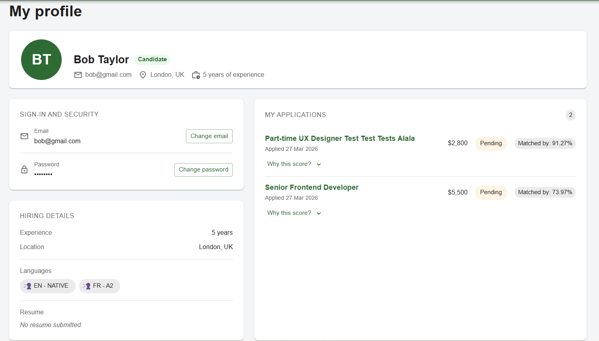

# Frontend - Hiring Optimization & Automation Platform

React 19 + TypeScript + Vite SPA.

For what the project is, the architecture diagrams, the live demo and the demo accounts, see the
[root README](../README.md).

## Run it

```bash
cp .env.example .env
npm ci
npm run dev                   # http://localhost:5173
```

On every push these three comands will be run (see
[root .github\workflows](../.github/workflows/frontend-ci.yml):

```bash
npm run typecheck
npm run lint
npm run build
```

## How state is organised

Server state and client state are kept apart on purpose.

- **Server state** goes through RTK Query (`src/app/api/baseApi.ts`). Endpoints declare tags, mutations invalidate them, and the cache refetches itself. No manual loading flags, no data copied into Redux.
- **Client state** lives in Redux Toolkit slices, and only for things the client genuinely owns: the session and filter state.

`prepareHeaders` attaches the access token to every request except those marked
`PUBLIC_ENDPOINT`. `RestoreSession` dispatches a refresh on mount, so a page reload keeps you
logged in. `RequireAuth` and `RequireRole` guard the routes.

## Layout

```
src/
├── app/        store, RTK Query base API, theme, config
├── features/   auth, vacancies, vacancySubmissions, interviews,
│               questions, profile, clustering, home
├── routing/    RequireAuth, RequireRole, RestoreSession, routes
├── layout/     shell, navigation
└── shared/     reusable UI, hooks, helpers
```

Each feature owns its `api/`, `model/`, `components/` and `pages/`, so a feature can be read or
removed on its own.

## Screenshots

**Sign in**


**Creating a vacancy**


**Filtering vacancies**


**Vacancy list**


**My Profile Page**

